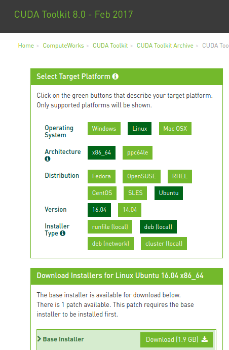
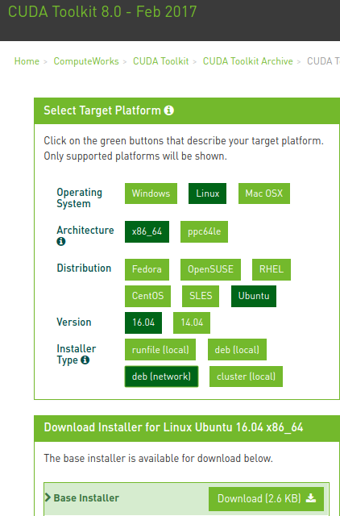
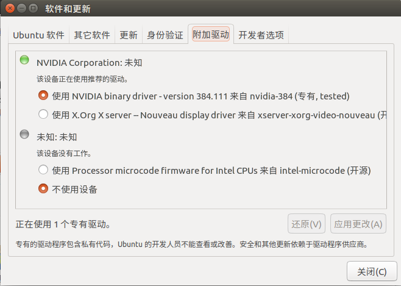
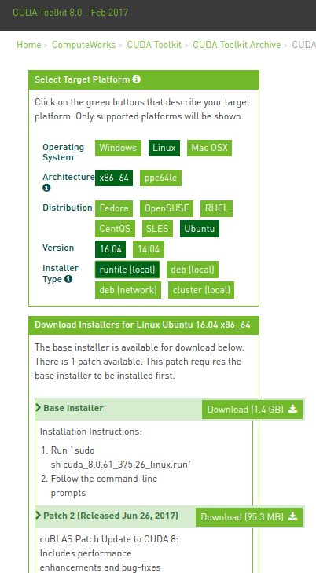
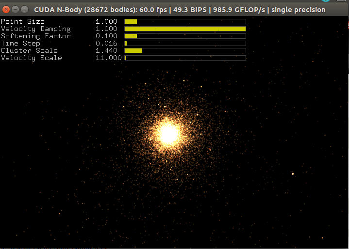

# ubuntu16.04安装CUDA8.0+cuDNN5.1

##  1. 安装前的预备知识/Pre-installation Actions

CUDA是NVIDIA公司开发的一套并行计算平台和编程模型，它通过GPU（显卡）的强大计算能力显著地提高程序的运行速度。它实际上只是在C语言的基础上提供了一组扩展，所以其cuda代码的风格与C语言十分相似。

为了在你的Linux系统中使用CUDA，需要做以下准备工作：

- **确认你的电脑上有一张支持CUDA的显卡**

首先，*只有英伟达的显卡才可以使用CUDA*，可以在命令行输入命令：

```
lspci | grep -i nvidia
```

来确认是否是英伟达显卡。

只有英伟达的部分中高端显卡才支持CUDA，因此确认是英伟达的显卡之后，还要查看你的显卡型号是否包含在NVIDIA官网的[CUDA GPUs列表](https://developer.nvidia.com/cuda-gpus)里面，里面包含的显卡类型都支持CUDA。

- **确认你安装的Linux发行版**

Linux发行版数量繁多。但英伟达CUDA开发工具仅支持只有几个主流的Linux发行版，可以通过以下命令来查看你的部分系统信息：

```
uname -m && cat /etc/*release
```

查看[CUDA支持的Linux版本](http://docs.nvidia.com/cuda/cuda-installation-guide-linux/#system-requirements)，确认你的系统是否支持。

- **确认你的系统安装了gcc编译工具**

这个条件一般情况下是满足的，因为一般的Linux发行版在安装系统时就默认安装了gcc。运行CUDA程序的时候不需要gcc，但是在使用CUDA工具进行开发的时候需要用到它。可以在bash中输入以下命令确认：

```
gcc --version
```

- **确认你的系统已经安装了正确的kernel headers and development packages**

在安装CUDA驱动前，必须要安装好与你的Linux系统内核版本相匹配的内核头和开发包。比如你的系统内核版本是3.17.4-301，那么你必须也要安装3.17.4-301版本的内核头和开发包。

使用以下命令确认你的系统内核版本：

```
uname -r
```

比如我的系统内核版本是：

```
ys@ysubuntu:~$ uname -r
4.13.0-26-generic
```

然后根据你的系统内核版本使用apt命令安装对应的内核头和开发包。在ubuntu中使用以下命令：

```
sudo apt-get install linux-headers-$(uname -r)
```

当然，如果你的系统本身就满足要求，输入这条命令不会安装新的东西，比如我的情况：

```
ys@ysubuntu:~$ sudo apt-get install linux-headers-$(uname -r)
[sudo] ys 的密码： 
正在读取软件包列表... 完成
正在分析软件包的依赖关系树       
正在读取状态信息... 完成       
linux-headers-4.13.0-26-generic 已经是最新版 (4.13.0-26.29~16.04.2)。
linux-headers-4.13.0-26-generic 已设置为手动安装。
下列软件包是自动安装的并且现在不需要了：
  iucode-tool snap-confine
使用'sudo apt autoremove'来卸载它(它们)。
升级了 0 个软件包，新安装了 0 个软件包，要卸载 0 个软件包，有 1 个软件包未被升级。
```

其他Linux发行版安装内核头和开发包的命令参考[这里](http://docs.nvidia.com/cuda/cuda-installation-guide-linux/#verify-kernel-packages)。

- **选择一种安装方法**

 CUDA Toolkit 可以使用*2种不同的安装机制*进行安装：

1. 使用指定发行版的安装包，也就是常用的.rpm包或者.deb包。
2. 使用runfile包，后缀名为.run文件。

两种安装方式的优缺点：

使用.run包的优点是支持更多的Linux发行版，不管是使用.deb格式的Ubuntu/Debian，还是使用.rpm格式的其他大多数Linux发行版；其缺点是无法更新Linux系统的本地包管理系统，也就是只能单机/standalone安装，无法下线更新，而且只支持64位的系统。

使用指定发行版的安装包的优缺点和使用.run包刚好相反。

- **处理安装冲突的方法**

这一点主要针对的是目前你要安装的CUDA Toolkit或者NVIDIA Driver和你电脑上以前安装的版本的冲突问题，如果你是第一次安装CUDA Toolkit和NVIDIA Driver，那么请跳过这一点。

如果你以前在你电脑上已经安装了另一个版本的CUDA Toolkit或者NVIDIA Driver，那就得注意了，因为现在安装的版本和以前安装的版本存在一个兼容性问题。看下图展示的CUDA和英伟达显卡驱动的兼容性表：


内容很清晰，这里就不解释了。

如果存在冲突，则要先卸载之前安装的相应CUDA Toolkit或者NVIDIA Driver。

使用以下命令来卸载之前安装的.run格式的CUDA Toolkit：

```
sudo /usr/local/cuda-X.Y/bin/uninstall_cuda_X.Y.pl
```

也就是运行`/usr/local/cuda-X.Y/bin/`文件夹下的`uninstall_cuda_X.Y.pl`文件。其中的X.Y是之前你安装的CUDA Toolkit的版本号，如果不清楚是多少，`cd`到`/usr/local/`目录并使用`ls`命令来查看。

使用以下命令来卸载.run格式的显卡驱动：

```
sudo /usr/bin/nvidia-uninstall
```

使用下面的命令来卸载一个.rpm/.deb格式的版本：

```
sudo yum remove <package_name> # Redhat/CentOS 
sudo dnf remove <package_name> # Fedora 
sudo zypper remove <package_name> # OpenSUSE/SLES 
sudo apt-get --purge remove <package_name> # Ubuntu
```

## 2.  安装过程/Installation—CUDA8.0

参考自英伟达官网[Package Manager Installation](http://docs.nvidia.com/cuda/cuda-installation-guide-linux/#package-manager-installation).

下面简单记录两种安装方式的安装过程，只针对ubuntu，其他发行版请参考上一行的链接。

### 2.1 .deb格式的安装过程 

.deb格式的安装又分为2种安装方式：`deb(local)`和`deb(network)`，也就是提供了2种类型的.deb包供下载。

本地的.deb包很大，大约有1.9G，这种方式下，安装开始时，dpkg包管理器将会安装一个本地仓库，仓库中存放了实际的安装包文件，并将本地仓库路径添加到APT高级包管理工具的安装包源仓库列表中。



而在线的.deb包则只有几个kb大小，同样使用dpkg安装，安装过程中，会告诉APT高级包管理工具到哪个在线源仓库去下载实际安装包文件。



安装过程如下：

* **下载.deb安装包**

下载地址：<https://developer.nvidia.com/cuda-80-ga2-download-archive>

根据个人爱好，下载`deb(local)`或者`deb(network)`都可以。

* **安装仓库元数据**

这一步使用dpkg命令安装你下载的.deb包：

```
sudo dpkg -i cuda-repo-<distro>-<version>.<architecture>.deb
```

上面的包名改成你实际下载的.deb包名，我下载的

* **安装 CUDA public GPG key(这一步好像不需要执行？)**

虽然在线包和本地包的原理不同，但是安装过程的命令就这一步有区别。

如果你下载的本地.deb包，执行如下命令：

```
sudo apt-key add /var/cuda-repo-<version>/7fa2af80.pub
```

同样，这里`/var/`文件夹下的具体.pub文件名称改成你实际的名称。

如果你下载的在线.deb包，执行如下命令：

```
sudo apt-key adv --fetch-keys https://developer.download.nvidia.com/compute/cuda/repos/<distro>/<architecture>/7fa2af80.pub
```
* **更新Apt repository cache**

执行如下命令：

```
sudo apt-get update
```
* **安装CUDA**

```
sudo apt-get install cuda
```

### 2.2 .run文件的安装过程

这一段是我实际的安装过程，因为刚刚安装完系统字后，就在系统设置-》软件与更新-》附加驱动这里安装了较新版本的英伟达显卡驱动：



而且忘了曾经在哪儿看到过，说.run文件中带的显卡驱动的版本通常已经过时，所以显卡驱动就用这个办法安装是最方便的。同时上图中下面一个未知驱动不要使用它，据说是CPU中自带的英特尔显卡驱动。

* **下载.run安装包**

下载地址：<https://developer.nvidia.com/cuda-80-ga2-download-archive>

选择下载runfile格式：



网址中下载的版本是cuda8.0.61，我实际上使用的是上一个版本cuda8.0.44：

`cuda_8.0.44_linux.run`

* **禁止Nouveau驱动**

  使用gedit打开/etc/modprobe.d/blacklist-nouveau.conf文件：

```
sudo gedit /etc/modprobe.d/blacklist-nouveau.conf
```

在其中加入两行语句：

```
blacklist nouveau
options nouveau modeset=0
```

我打开时它是一个空文件，反正就照着做吧，没影响。

再执行下面这句命令：

```
sudo update-initramfs -u
```

运行完重启系统。

* **执行runfile文件安装CUDA Toolkit**

```
sudo bash cuda_8.0.44_linux.run
```

开始时会出现一长段说明文档，直接按住`Ctrl+C`跳过这一段，直接进入安装选项。

```
Linux platform:
Do you accept the previously read EULA?
accept/decline/quit: accept

Install NVIDIA Accelerated Graphics Driver for Linux-x86_64 367.48?
(y)es/(n)o/(q)uit: n

```

注意，上面的第二个选项问是否安装显卡驱动，一定要写n，因为之前已经安装过显卡驱动了。其他部分就全部是y或者直接enter。

安装过程遇到了以下错误：

```
Installing the CUDA Toolkit in /usr/local/cuda-8.0 ...
Missing recommended library: libGLU.so 
Missing recommended library: libXmu.so
```

网上搜索，说是缺少了几个依赖项，用以下命令安装：

```
sudo apt-get install freeglut3-dev build-essential libx11-dev libxmu-dev libxi-dev libgl1-mesa-glx libglu1-mesa libglu1-mesa-dev 
```

因为上面虽然提示安装完成：

```
Toolkit:  Installed in /usr/local/cuda-8.0
```

但不清楚有没有影响，于是使用下面命令将CUDA Toolkit卸载了：

```
sudo /usr/local/cuda-8.0/bin/uninstall_cuda_8.0.pl
```

再使用最开始的命令重新再装一遍，但是这次只选择装CUDA Toolkit。

总之，如果不算显卡驱动，cuda就安装了两个工具：CUDA 8.0 Toolkit和CUDA 8.0 Samples。

无论其中哪一块安装出错，都可以使用以下命令将其卸载：

```
sudo /usr/local/cuda-8.0/bin/uninstall_cuda_8.0.pl   #卸载CUDA 8.0 Toolkit

sudo /home/ys/NVIDIA_CUDA-8.0_Samples/uninstall_cuda_samples_8.0.pl  #卸载CUDA 8.0 Samples
```

另外，如果没有单独安装显卡驱动，而是使用了cuda安装包中提供的驱动，那么使用以下命令可卸载显卡驱动：

```
sudo /usr/bin/nvidia-uninstall
```
## 3 后处理/Post-installation Actions

安装完后，需要进行环境变量的设置。使用gedit打开~/.bashrc文件：

```
sudo gedit ~/.bashrc
```

在文件最后加入：

```
export PATH=/usr/local/cuda-8.0/bin${PATH:+:${PATH}}
export LD_LIBRARY_PATH=/usr/local/cuda-8.0/lib64${LD_LIBRARY_PATH:+:${LD_LIBRARY_PATH}}
```
即添加一个PATH变量和一个LD_LIBRARY_PATH变量。使用source命令令配置更改生效：

```
source ~/.bashrc
```
最后依次执行以下命令，运行一个sample来验证cuda工具是否安装成功

```
  cuda-install-samples-8.0.sh ~
  cd ~/NVIDIA_CUDA-8.0_Samples/5_Simulations/nbody
  make
  ./nbody
```
执行完会出现以下窗口：



## 4 安装cuDNN

cuDNN是英伟达开发的专门用于深度神经网络计算的GPU加速库。在CUDA工具基础上加上cuDNN能进一步加快那些基于英伟达GPU的深度模型的执行速度。也可以不用cuDNN库加速，就安装CUDA。

下面记录如何在CUDA里面加入cuDNN。

第一步肯定是下载cuDNN文件，网址在[这里](https://developer.nvidia.com/compute/machine-learning/cudnn/secure/v5.1/prod_20161129/8.0/cudnn-8.0-linux-x64-v5.1-tgz)。

下载得到此文件：cudnn-8.0-linux-x64-v5.1.tgz。

然后依次使用以下命令完成cuDNN的安装：

```
tar -xvf cudnn-8.0-linux-x64-v5.1.tgz       #解压cuDNN压缩包，得到cuda文件夹
cd cuda/include/                             
sudo cp cudnn.h /usr/local/cuda/include/    #复制cudnn.h文件到cuda对应的include文件夹
cd ../lib64/                                #cd到另一个目录
sudo cp lib* /usr/local/cuda/lib64/         #复制其下所有lib文件到cuda对应的lib64文件夹
cd /usr/local/cuda/lib64/
sudo rm -rf libcudnn.so libcudnn.so.5       #删除这两个文件，-r是递归,-f表示强制
sudo ln -s libcudnn.so.5.1.10 libcudnn.so.5 #将libcudnn.so.5链接到libcudnn.so.5.1.10
sudo ln -s libcudnn.so.5 libcudnn.so        #将libcudnn.so链接到libcudnn.so.5
```

解释以下上面的命令，cuDNN的安装其实就是将其下include/文件夹下的cudnn.h文件和lib64/文件夹下的所有文件复制安装的CUDA下对应的文件夹。

原来的lib64/文件夹下有三个so文件：libcudnn.so、libcudnn.so.5和libcudnn.so.5.1.10，并且这3个点so文件大小都一样。其实都是软连接！libcudnn.so链接到libcudnn.so.5，而libcudnn.so.5.又链接到libcudnn.so.5.1.10。 真正的文件只有libcudnn.so.5.1.10，因此我们要将/usr/local/cuda/lib64下的以前的这样的链接替换掉。

使用`rm -rf`命令先删除原来两个链接文件；再使用`ln -s`命令重新建立软链接。

使用由于装cuda时，比如我装的是cuda8.0，那么在/usr/local/下会生成cuda-8.0/文件夹，以及一个cuda/文件夹，cuda/是软链接到cuda-8.0/的，所以这两个文件夹可以看成一个。往任意一个文件夹中添加东西，另一个文件夹都会有相同的东西。

使用`ll`命令(`ll`是`ls -l`的缩写，功能是显示当前目录下文件详细信息)可以查看文件的软链接关系：

```
ys@ysubuntu:~$ cd /usr/local
ys@ysubuntu:/usr/local$ ll
总用量 44
drwxr-xr-x 11 root root 4096 1月  17 15:58 ./
drwxr-xr-x 12 root root 4096 1月  14 19:58 ../
drwxr-xr-x  2 root root 4096 2月  16  2017 bin/
lrwxrwxrwx  1 root root   19 1月  17 15:58 cuda -> /usr/local/cuda-8.0/ # ->就代表了软链接
drwxr-xr-x 17 root root 4096 1月  17 15:58 cuda-8.0/
...
```

至此，CUDA和cuDNN安装完毕。


